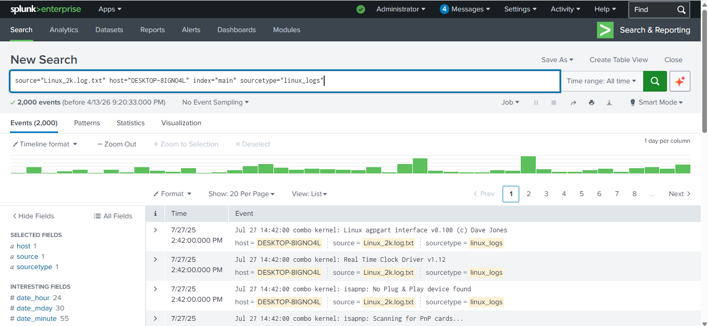
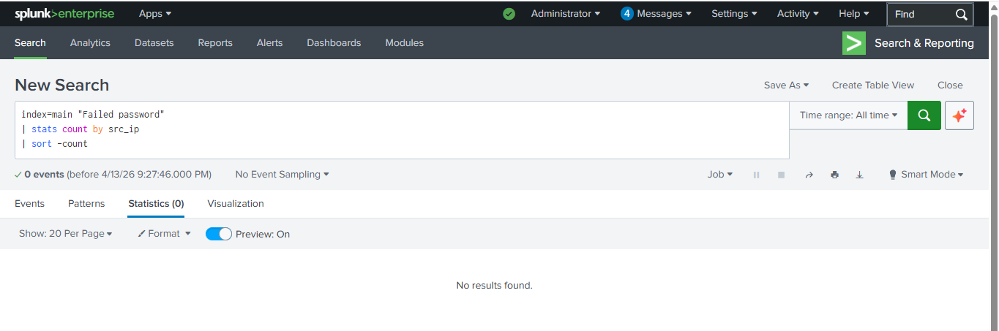

# SOC Incident Investigation using Splunk

## Project Overview

This project demonstrates a basic Security Operations Center (SOC) investigation using Splunk SIEM.
The goal of this project is to analyze authentication logs and detect suspicious login activity using Splunk queries.

Logs were uploaded into Splunk and analyzed using Splunk Search Processing Language (SPL) to investigate login behavior and potential security threats.

---

## Tools Used

* Splunk Enterprise (SIEM Platform)
* Linux Authentication Logs
* Log Analysis using SPL Queries

---

## Investigation Steps

1. Uploaded Linux authentication logs into Splunk using **Add Data → Upload**.
2. Indexed the logs into the **main index**.
3. Used Splunk queries to analyze authentication events.
4. Investigated login activity and suspicious patterns.

---

## Splunk Queries Used

### View All Logs

```
index=main
```

---

### Detect Failed Login Attempts

```
index=main "Failed password"
```

---

### Identify Suspicious IP Addresses

```
index=main "Failed password"
| stats count by src_ip
| sort -count
```

---

## Investigation Screenshots

### Data Upload into Splunk


---

### Viewing All Logs



---

### Failed Login Detection


---

### Suspicious IP Detection



---

## Findings

Authentication logs were analyzed using Splunk SIEM to identify suspicious login behavior.
Queries were used to detect failed login attempts and analyze potential attacker IP addresses.

---

## Conclusion

This project demonstrates how Splunk can be used as a SIEM tool to analyze logs, detect suspicious activity, and support SOC investigations.

---

## Author

Vivek Sharma
Cybersecurity Enthusiast

GitHub: https://github.com/vivek-sh45
LinkedIn: https://www.linkedin.com/in/vivek-sharma-370741392/
